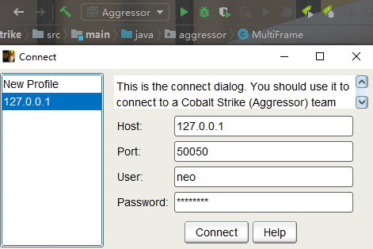

## CobaltStrike source code

CobaltStrike's source code,tested some code and function

Thanks to [cs](https://www.cobaltstrike.com/), [jetbrains](https://www.jetbrains.com/?from=https://github.com/Freakboy/CobaltStrike)

This src code could be run in IDEA,depends jdk8+,gradle 5.x

Not a simple reverse code,make sure that the code and functions are working done,build pass and tested

Restore the framework searched by the target as much as possible during development

### Some frameworks

**jgraphx-4.0.4**

project url: [jgraphx](https://github.com/Freakboy/jgraphx)

Build in myself, I finded all version src code in github,but isn't match, I choose this version add some class and funcs

**tightvnc-jviewer-2.6**

project url: [tvnjviewer](https://github.com/Freakboy/tvnjviewer)

Build in myself, I used burp foreached offical website all version, but viewer_swing module lost some files,so I choose this version add some class, funs and build settings.

### other depends

**sleep2.1**

**synthetica-2.30.0**

**xfc-6.3.0**

**UserAgentUtils-1.21**

**fop-1.1**

### Some function screenshot

This code is only for research and learning, if there is any infringement, it will be deleted immediately
